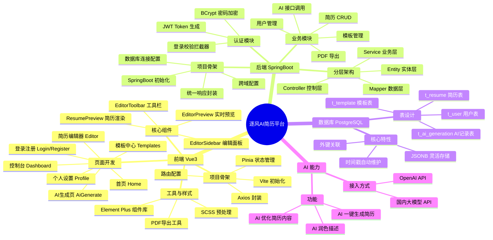
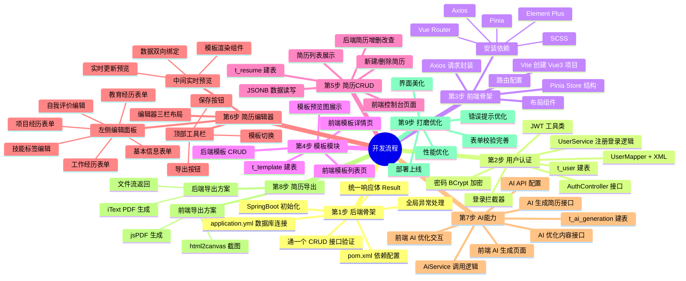
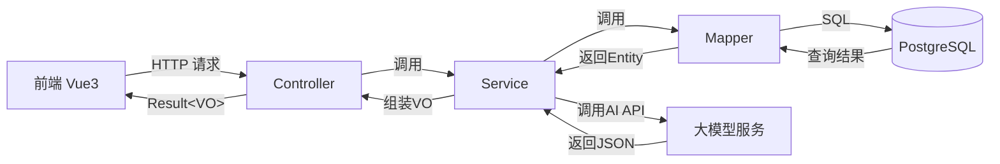
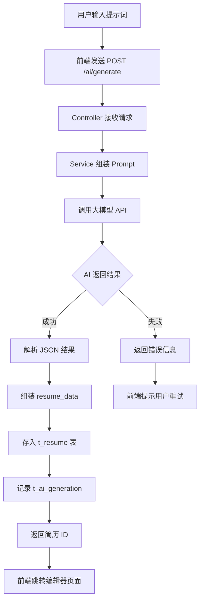
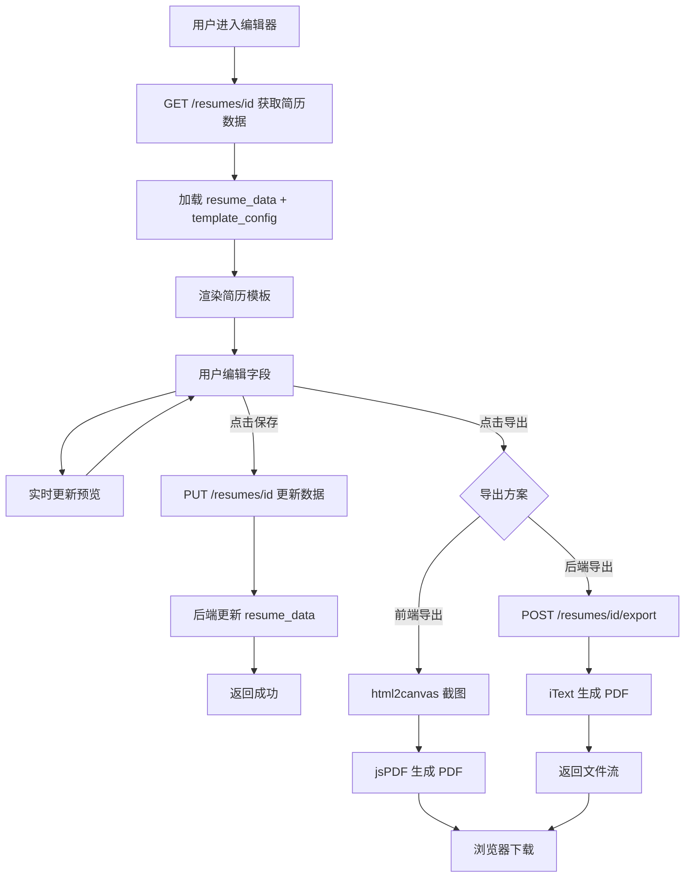
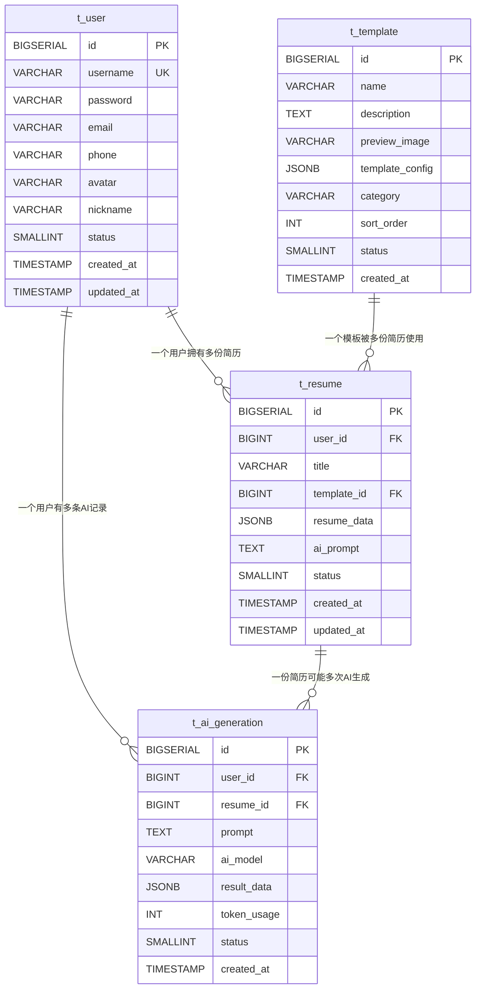

# 逐风 AI 简历平台 — 开发流程思维导图

> 使用 Mermaid 语法绘制，支持在 VS Code、GitHub、Typora 等工具中直接渲染

---

## 一、项目总览思维导图



---

## 二、开发流程思维导图



---

## 三、后端请求流转流程图



---

## 四、AI 生成简历流程图



---

## 五、简历编辑与导出流程图



---

## 六、用户认证流程图

```mermaid
flowchart TD
    subgraph 注册流程
        R1[用户填写注册信息] --> R2[POST /auth/register]
        R2 --> R3[校验用户名唯一性]
        R3 -->|已存在| R4[返回用户名已占用]
        R3 -->|不存在| R5[BCrypt 加密密码]
        R5 --> R6[存入 t_user]
        R6 --> R7[返回注册成功]
    end

    subgraph 登录流程
        L1[用户输入账号密码] --> L2[POST /auth/login]
        L2 --> L3[查询用户]
        L3 -->|不存在| L4[返回账号或密码错误]
        L3 -->|存在| L5[BCrypt 校验密码]
        L5 -->|不匹配| L4
        L5 -->|匹配| L6[生成 JWT Token]
        L6 --> L7[返回 Token + 用户信息]
    end

    subgraph 请求鉴权
        A1[前端携带 Token 请求] --> A2[JwtAuthInterceptor 拦截]
        A2 --> A3[解析验证 Token]
        A3 -->|无效或过期| A4[返回 401 未授权]
        A3 -->|有效| A5[放行到 Controller]
    end
```



---

## 七、数据库 ER 关系图



---

## 八、前端路由与页面结构图

```mermaid
flowchart TD
    subgraph 公开页面
        HOME[/home 首页]
        LOGIN[/login 登录]
        REGISTER[/register 注册]
        TEMPLATES[/templates 模板中心]
    end

    subgraph 需要登录
        DASHBOARD[/dashboard 控制台]
        EDITOR[/editor/:id 简历编辑器]
        AI[/ai-generate AI生成]
        PROFILE[/profile 个人设置]
    end

    HOME --> LOGIN
    HOME --> REGISTER
    HOME --> TEMPLATES
    LOGIN --> DASHBOARD
    REGISTER --> DASHBOARD
    DASHBOARD --> EDITOR
    DASHBOARD --> AI
    DASHBOARD --> PROFILE
    AI -->|生成成功| EDITOR
    TEMPLATES -->|选择模板| EDITOR

    subgraph 编辑器内部
        EDITOR --> TOOLBAR[EditorToolbar 工具栏]
        EDITOR --> SIDEBAR[EditorSidebar 编辑面板]
        EDITOR --> PREVIEW[EditorPreview 实时预览]
    end
```
